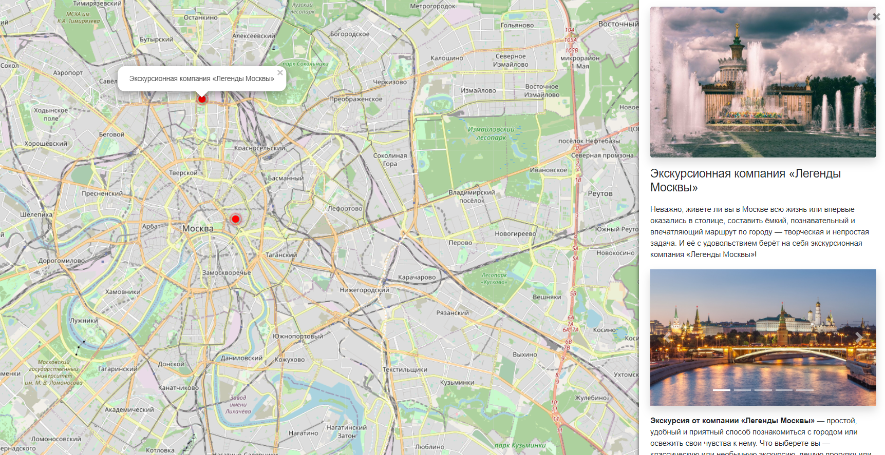

# Интерактивная карта Москвы с интересными местами

Сайт отображает интересные места Москвы с фотками и описанием. Наполняется через админку.

[Демо сайта](#)

[Админка](#) логин `admin`, пароль `dvmn2021`



## Запуск

Для запуска сайта вам понадобится Python третьей версии.

Скачайте код с GitHub. Установите зависимости:

```sh
pip install -r requirements.txt
```

Создайте базу данных SQLite.

```sh
python manage.py migrate
```

Запустите разработческий сервер.

```sh
python manage.py runserver
```

Для доступа в админку создайте пользователя перейдите по адресу `/admin/` в браузере.

```sh
python manage.py createsuperuser
```

## Переменные окружения

Часть настроек проекта берётся из переменных окружения. Чтобы их определить, создайте файл `.env` рядом с `manage.py` и запишите туда данные в таком формате: `ПЕРЕМЕННАЯ=значение`.

Доступны следующие переменные:
- `DEBUG` — дебаг-режим. Поставьте `True`, чтобы увидеть отладочную информацию в случае ошибки.
- `SECRET_KEY` — секретный ключ проекта
- `DATABASE_FILEPATH` — путь к файлу базы данных SQLite, например: `db.sqlite3`
- `ALLOWED_HOSTS` — см [документацию Django](https://docs.djangoproject.com/en/3.1/ref/settings/#allowed-hosts)


## Цели проекта

Код написан в учебных целях — для курса по Python и веб-разработке на сайте [Devman](https://dvmn.org).
